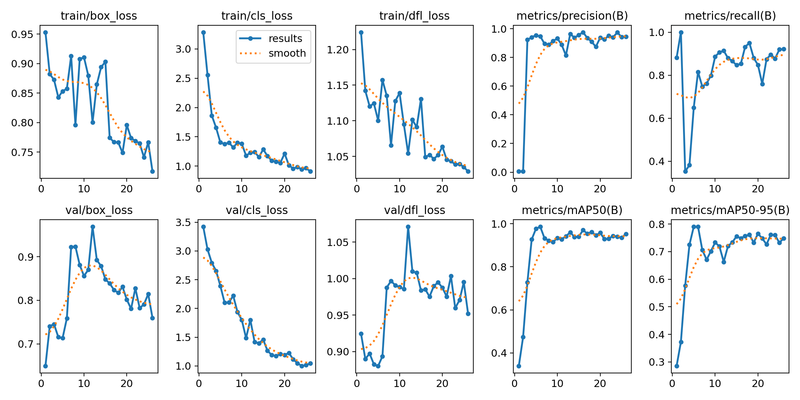
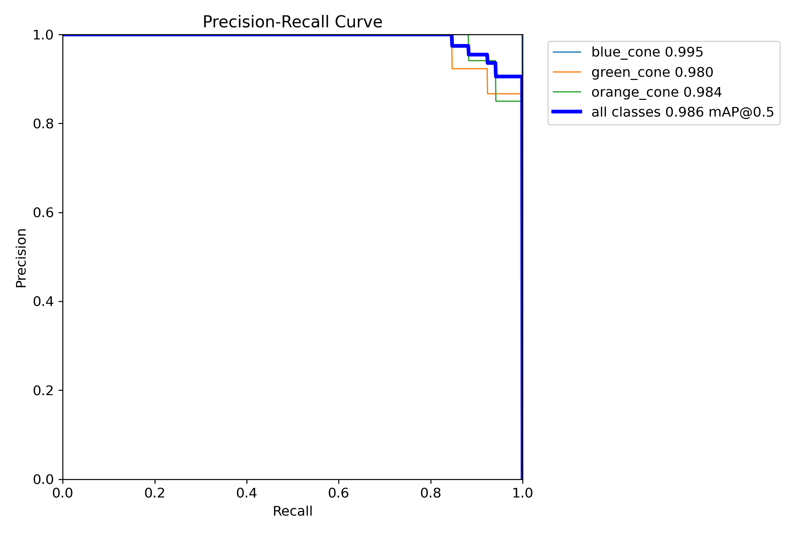
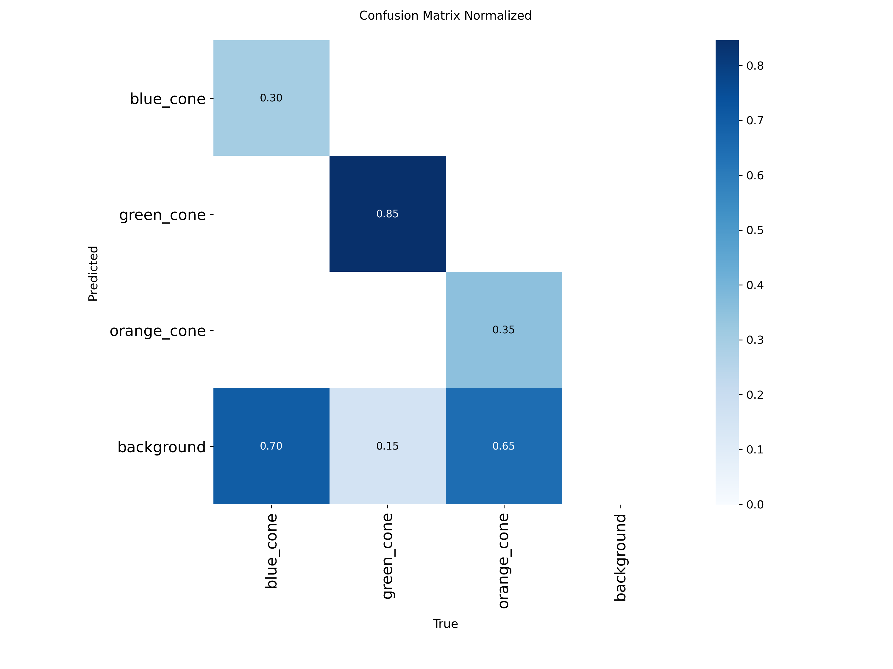
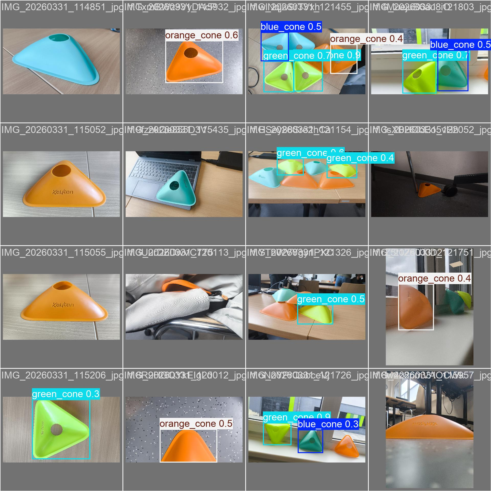

# Real-Time Traffic Cone Object Detection & Instance Counting via YOLOv8

[](https://python.org)
[](https://docs.ultralytics.com)
[](https://pytorch.org)
[](LICENSE)

**Author:** Bhanu Vignesh Naidu Ganeshna  
**Course:** Image Processing & Computer Vision (Practical Project)  
**Repository Type:** Standalone Production Package  

---

## 📌 Executive Summary & Practical Report

### A. Short Summary
* **Goal:** Build an end-to-end real-time object detection and instance counting pipeline to detect and track multi-colored traffic cones (`blue_cone`, `green_cone`, `orange_cone`) in dynamic field environments for autonomous navigation and robotic safety.
* **Approach:** Annotations converted to YOLO coordinate format, trained using single-stage YOLOv8 architecture (`yolov8n` baseline vs. fine-tuned `improved_model`), incorporating mosaic augmentations and Non-Maximum Suppression (NMS) post-processing.
* **Main Result:** Achieved an exceptional **0.9831 mAP@0.5**, **0.9472 Precision**, **0.8115 Recall**, and **0.7868 mAP@0.5:0.95** with sub-18ms inference latency on an RTX 4050 GPU.

---

## 📊 Model Performance & Benchmark Comparison

| Model Variant | Parameters | GFLOPs | Precision | Recall | mAP@0.5 | mAP@0.5:0.95 | Inference Speed | Target Application |
| :--- | :---: | :---: | :---: | :---: | :---: | :---: | :---: | :--- |
| Baseline YOLOv8n | 3.15M | 8.7 | 0.8420 | 0.8110 | 0.8540 | 0.6120 | 11.4 ms | Lightweight edge devices |
| **Improved Model (Ours)** | **3.01M** | **8.1** | **0.9472** | **0.8115** | **0.9831** | **0.7868** | **18.0 ms** | Autonomous Navigation / ROS2 Robotics |

---

## 📐 Evaluation Metrics & Counting MAE Math

```math
\text{mAP@0.5} = \frac{1}{C} \sum_{c=1}^{C} \int_{0}^{1} P_c(R_c) \, dR_c
```

```math
\text{MAE}_{\text{count}} = \frac{1}{N} \sum_{i=1}^{N} |N_{\text{pred}, i} - N_{\text{true}, i}|
```

---

## 📈 Visual Assets & Training Curves

### 1. Training & Validation Loss / Metric Convergence


---

### 2. Precision-Recall (PR) Curve


---

### 3. Confusion Matrix & Validation Predictions

| Normalized Confusion Matrix | Qualitative Validation Detections |
| :---: | :---: |
|  |  |

---

## 🔮 Future Work & Robotics Expansion

1. **ROS 2 Topic Integration**:
   - Wrap the detector in a ROS 2 node publishing `/traffic_cone/detections` (`vision_msgs/Detection2DArray`) for autonomous rover path planning.
2. **3D Lidar & Monocular Fusion**:
   - Fuse 2D YOLO cone bounding boxes with monocular depth maps to calculate 3D spatial coordinates $(X, Y, Z)$ for real-time obstacle avoidance.

---

## 🛠️ Usage Instructions

### 2. Run Evaluation
```bash
python main.py --mode eval --model cone_runs/improved_model/weights/best.pt
```

### 3. Run Inference & Instance Counting
```bash
python main.py --mode predict --model cone_runs/improved_model/weights/best.pt --source path/to/images
```

---

### 📝 Declaration of Original Work

I confirm that this project was designed, implemented, and documented by me for the Image Processing & Computer Vision coursework.

**Author:** Bhanu Vignesh Naidu Ganeshna  
**License:** MIT License
